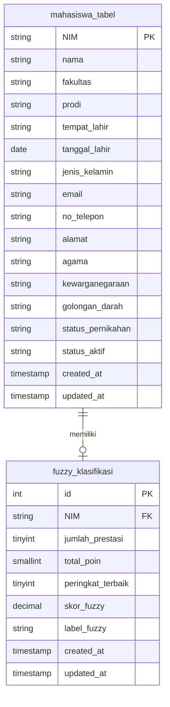

# Dokumentasi Sistem Fuzzy Prestasi Mahasiswa

## 1. Fungsi Keanggotaan (Membership Functions)

Metode: **Trapesium** — $\mu(x) = \begin{cases} 0, & x < a \text{ atau } x > d \\ \frac{x - a}{b - a}, & a \le x < b \\ 1, & b \le x \le c \\ \frac{d - x}{d - c}, & c < x \le d \end{cases}$

---

### 1.1 Variabel Input: Jumlah Prestasi

Domain: **[0, 10]**

| Himpunan | a | b | c | d | Rumus |
|----------|---|---|---|-----|-------|
| **Sedikit** | 0 | 0 | 2 | 3 | $\mu(x) = \begin{cases} 1, & 0 \le x \le 2 \\ \frac{3-x}{1}, & 2 < x \le 3 \\ 0, & x > 3 \end{cases}$ |
| **Sedang** | 2 | 3 | 5 | 6 | $\mu(x) = \begin{cases} \frac{x-2}{1}, & 2 \le x < 3 \\ 1, & 3 \le x \le 5 \\ \frac{6-x}{1}, & 5 < x \le 6 \\ 0, & x < 2 \text{ atau } x > 6 \end{cases}$ |
| **Banyak** | 5 | 6 | 10 | 10 | $\mu(x) = \begin{cases} \frac{x-5}{1}, & 5 \le x < 6 \\ 1, & 6 \le x \le 10 \\ 0, & x < 5 \end{cases}$ |

---

### 1.2 Variabel Input: Total Poin

Domain: **[0, 120]**

| Himpunan | a | b | c | d | Rumus |
|----------|---|---|---|-----|-------|
| **Rendah** | 0 | 0 | 20 | 40 | $\mu(x) = \begin{cases} 1, & 0 \le x \le 20 \\ \frac{40-x}{20}, & 20 < x \le 40 \\ 0, & x > 40 \end{cases}$ |
| **Sedang** | 20 | 40 | 60 | 80 | $\mu(x) = \begin{cases} \frac{x-20}{20}, & 20 \le x < 40 \\ 1, & 40 \le x \le 60 \\ \frac{80-x}{20}, & 60 < x \le 80 \\ 0, & x < 20 \text{ atau } x > 80 \end{cases}$ |
| **Tinggi** | 60 | 80 | 120 | 120 | $\mu(x) = \begin{cases} \frac{x-60}{20}, & 60 \le x < 80 \\ 1, & 80 \le x \le 120 \\ 0, & x < 60 \end{cases}$ |

---

### 1.3 Variabel Input: Kualitas Peringkat

Domain: **[1, 50]** (semakin kecil nilai, semakin baik peringkat)

| Himpunan | a | b | c | d | Rumus |
|----------|---|---|---|-----|-------|
| **Terbaik** | 1 | 1 | 3 | 5 | $\mu(x) = \begin{cases} 1, & 1 \le x \le 3 \\ \frac{5-x}{2}, & 3 < x \le 5 \\ 0, & x > 5 \end{cases}$ |
| **Mendekati** | 5 | 10 | 15 | 20 | $\mu(x) = \begin{cases} \frac{x-5}{5}, & 5 \le x < 10 \\ 1, & 10 \le x \le 15 \\ \frac{20-x}{5}, & 15 < x \le 20 \\ 0, & x < 5 \text{ atau } x > 20 \end{cases}$ |
| **Jauh** | 15 | 20 | 50 | 50 | $\mu(x) = \begin{cases} \frac{x-15}{5}, & 15 \le x < 20 \\ 1, & 20 \le x \le 50 \\ 0, & x < 15 \end{cases}$ |

---

### 1.4 Variabel Output: Skor Prestasi

Domain: **[0, 100]**

| Himpunan | a | b | c | d | Rumus |
|----------|---|---|---|-----|-------|
| **Kurang Berprestasi** | 0 | 0 | 20 | 35 | $\mu(x) = \begin{cases} 1, & 0 \le x \le 20 \\ \frac{35-x}{15}, & 20 < x \le 35 \\ 0, & x > 35 \end{cases}$ |
| **Cukup Berprestasi** | 20 | 35 | 45 | 60 | $\mu(x) = \begin{cases} \frac{x-20}{15}, & 20 \le x < 35 \\ 1, & 35 \le x \le 45 \\ \frac{60-x}{15}, & 45 < x \le 60 \\ 0, & x < 20 \text{ atau } x > 60 \end{cases}$ |
| **Berprestasi** | 45 | 60 | 70 | 85 | $\mu(x) = \begin{cases} \frac{x-45}{15}, & 45 \le x < 60 \\ 1, & 60 \le x \le 70 \\ \frac{85-x}{15}, & 70 < x \le 85 \\ 0, & x < 45 \text{ atau } x > 85 \end{cases}$ |
| **Sangat Berprestasi** | 70 | 85 | 100 | 100 | $\mu(x) = \begin{cases} \frac{x-70}{15}, & 70 \le x < 85 \\ 1, & 85 \le x \le 100 \\ 0, & x < 70 \end{cases}$ |

---

## 2. Rule Base (27 Aturan Mamdani)

| # | IF Jumlah | AND Poin | AND Peringkat | THEN Output |
|---|-----------|----------|---------------|-------------|
| 1 | sedikit | rendah | jauh | Kurang Berprestasi |
| 2 | sedikit | rendah | mendekati | Kurang Berprestasi |
| 3 | sedikit | rendah | terbaik | Cukup Berprestasi |
| 4 | sedikit | sedang | jauh | Kurang Berprestasi |
| 5 | sedikit | sedang | mendekati | Cukup Berprestasi |
| 6 | sedikit | sedang | terbaik | Cukup Berprestasi |
| 7 | sedikit | tinggi | jauh | Cukup Berprestasi |
| 8 | sedikit | tinggi | mendekati | Cukup Berprestasi |
| 9 | sedikit | tinggi | terbaik | Berprestasi |
| 10 | sedang | rendah | jauh | Kurang Berprestasi |
| 11 | sedang | rendah | mendekati | Cukup Berprestasi |
| 12 | sedang | rendah | terbaik | Cukup Berprestasi |
| 13 | sedang | sedang | jauh | Cukup Berprestasi |
| 14 | sedang | sedang | mendekati | Berprestasi |
| 15 | sedang | sedang | terbaik | Berprestasi |
| 16 | sedang | tinggi | jauh | Berprestasi |
| 17 | sedang | tinggi | mendekati | Berprestasi |
| 18 | sedang | tinggi | terbaik | Sangat Berprestasi |
| 19 | banyak | rendah | jauh | Cukup Berprestasi |
| 20 | banyak | rendah | mendekati | Berprestasi |
| 21 | banyak | rendah | terbaik | Berprestasi |
| 22 | banyak | sedang | jauh | Berprestasi |
| 23 | banyak | sedang | mendekati | Berprestasi |
| 24 | banyak | sedang | terbaik | Sangat Berprestasi |
| 25 | banyak | tinggi | jauh | Berprestasi |
| 26 | banyak | tinggi | mendekati | Sangat Berprestasi |
| 27 | banyak | tinggi | terbaik | Sangat Berprestasi |

Metode inferensi: **Min-Max** (firing strength = min dari 3 antecedent, agregasi = max untuk tiap label output)

---

## 3. ERD — Tabel `fuzzy_klasifikasi`



**Relasi:** `fuzzy_klasifikasi.NIM` → foreign key ke `mahasiswa_tabel.NIM` (one-to-one, cascade on delete/update).

---

## 4. Flowchart — Alur Logika Program

```mermaid
flowchart TD
    A[Mulai] --> B[User akses halaman dashboard]
    B --> C[Route / dashboard memanggil FuzzyPrestasiService]
    C --> D[classifyAll: ambil semua mahasiswa dari DB]
    D --> E[Loop tiap mahasiswa]
    E --> F[classify(NIM)]
    
    subgraph proses[Proses Fuzzy Satu Mahasiswa]
        F --> G[Ambil pendaftaran_prestasi status=disetujui]
        G --> H[Hitung jumlah_prestasi]
        H --> I[ jumlah_prestasi == 0?]
        I -- Ya --> J[Return skor=0, label='Tidak Ada Data']
        I -- Tidak --> K[Akumulasi total_poin dari bobot_referensi]
        K --> L[Cari peringkat_terbaik capaian_prestasi]
        L --> M[Fuzzifikasi: 3 input -> derajat fuzzy]
        M --> N[Evaluasi 27 rules: min antecedent -> firing strength]
        N --> O[Aggregasi: max tiap label output]
        O --> P[Defuzzifikasi: centroid skor = sum(x*mu) / sum(mu)]
        P --> Q[Tentukan label dari skor: 0-25, 26-50, 51-75, 76-100]
        Q --> R[Return array: NIM, skor, label, dll]
    end
    
    R --> S[Simpan ke array results]
    S --> T[Mahasiswa berikutnya?]
    T -- Ya --> E
    T -- Tidak --> U[Sort results by skor DESC]
    U --> V[Return results ke controller]
    V --> W[Controller passing data ke view welcome.blade.php]
    W --> X[Tampilkan tabel + grafik + top 10 bar chart]
    X --> Y[Selesai]
```

---

## 5. Alur Logika Program (Penjelasan)

### 5.1 Struktur File

| File | Fungsi |
|------|--------|
| `app/Services/FuzzyPrestasiService.php` | Inti logika fuzzy: fuzzifikasi, rule evaluation, defuzzifikasi, classifyAll |
| `app/Http/Controllers/FuzzyKlasifikasiController.php` | CRUD untuk tabel fuzzy_klasifikasi |
| `app/Console/Commands/SeedFuzzyKlasifikasi.php` | Artisan command `seed:fuzzy-klasifikasi` untuk seed data |
| `app/Models/FuzzyKlasifikasi.php` | Model Eloquent (belongsTo Mahasiswa) |
| `database/migrations/..._create_fuzzy_klasifikasi_table.php` | Migration tabel penyimpanan hasil |
| `routes/web.php` | Route `/` (dashboard), `/fuzzy-klasifikasi`, `/fuzzy-grafik` |

### 5.2 Alur Lengkap

1. **Input Data** — Admin/Operator mengisi data mahasiswa, referensi kejuaraan, pendaftaran prestasi, dan capaian prestasi melalui CRUD module masing-masing.

2. **Trigger Klasifikasi** — Saat user mengakses halaman dashboard (`/`), route memanggil `FuzzyPrestasiService::classifyAll()`.

3. **Ambil Data** — Service mengambil seluruh mahasiswa dari DB, lalu untuk tiap mahasiswa:
   - Filter pendaftaran prestasi yang statusnya **disetujui**
   - Hitung jumlah prestasi, total poin (dari bobot_referensi), dan peringkat terbaik (dari capaian_prestasi)

4. **Fuzzifikasi** — Tiap input diubah ke derajat keanggotaan [0,1] menggunakan fungsi trapezoid.

5. **Inferensi** — 27 rules dievaluasi dengan operator **AND = min**, menghasilkan firing strength untuk tiap rule. Agregasi tiap label output menggunakan **MAX**.

6. **Defuzzifikasi** — Metode **Centroid**:
   ```
   skor = Σ(x * μ(x)) / Σ(μ(x)),  x = 0 s.d. 100 step 0.5
   ```
   dimana μ(x) = max(min(firingStrength_label, μ_output_label(x))) untuk semua label.

7. **Label** ditentukan dari skor:
   - 0–25 → Kurang Berprestasi
   - 26–50 → Cukup Berprestasi
   - 51–75 → Berprestasi
   - 76–100 → Sangat Berprestasi

8. **Output** — Hasil dikembalikan ke view dashboard dalam bentuk array yang sudah diurutkan DESC berdasarkan skor, lalu ditampilkan sebagai tabel dan grafik bar chart Top 10.

9. **Penyimpanan** (opsional) — Command `seed:fuzzy-klasifikasi` dapat dijalankan untuk menyimpan hasil ke tabel `fuzzy_klasifikasi` untuk keperluan pelaporan.

---

## 6. Contoh Manual: HALIS ANNISA (NIM 2455201110003)

**Data:**
- Jumlah prestasi disetujui = 3
- Total poin = 28
- Peringkat terbaik = 1

### 6.1 Fuzzifikasi

**Jumlah Prestasi (x=3):**
- Sedikit: trap(3; 0,0,2,3) → x=3 pada [c,d]=[2,3] → (3-3)/(3-2) = **0**
- Sedang: trap(3; 2,3,5,6) → x=3 pada [b,c]=[3,5] → **1**
- Banyak: trap(3; 5,6,10,10) → x < a → **0**

**Total Poin (x=28):**
- Rendah: trap(28; 0,0,20,40) → x=28 pada (20,40] → (40-28)/20 = **0.6**
- Sedang: trap(28; 20,40,60,80) → x=28 pada [20,40) → (28-20)/20 = **0.4**
- Tinggi: trap(28; 60,80,120,120) → x < a → **0**

**Kualitas Peringkat (x=1):**
- Terbaik: trap(1; 1,1,3,5) → x=1 pada [a,b]=[1,1] → **1**
- Mendekati: trap(1; 5,10,15,20) → x < a → **0**
- Jauh: trap(1; 15,20,50,50) → x < a → **0**

### 6.2 Rule Evaluation (Rules Aktif)

| Rule | IF | μ | THEN | min |
|------|----|---|------|-----|
| #12 | sedang, rendah, terbaik | 1, 0.6, 1 | Cukup Berprestasi | **0.6** |
| #15 | sedang, sedang, terbaik | 1, 0.4, 1 | Berprestasi | **0.4** |

Agregasi: {Kurang: 0, Cukup: **0.6**, Berprestasi: **0.4**, Sangat: 0}

### 6.3 Defuzzifikasi (Centroid)

Output trapezoid:
- Cukup: (20, 35, 45, 60) — fire strength 0.6
- Berprestasi: (45, 60, 70, 85) — fire strength 0.4

Perhitungan centroid step 0.5 dari x=0..100 menghasilkan **skor = 40**.

### 6.4 Label

Skor 40 → rentang 26–50 → **Cukup Berprestasi**

---

*Dokumen ini dibuat untuk memenuhi kebutuhan dokumentasi sistem fuzzy pendukung keputusan klasifikasi prestasi mahasiswa.*
