# Entity Relationship Diagram (ERD)

Database `db_tugas` (MySQL) terdiri dari **17 tabel** yang mencakup data master, transaksi prestasi, autentikasi, dan hasil klasifikasi fuzzy.

## Diagram Lengkap

```mermaid
erDiagram
    USERS {
        bigint id PK
        string name
        string email UK
        timestamp email_verified_at
        string password
        string role
        string remember_token
        timestamp created_at
        timestamp updated_at
    }
    ROLES {
        bigint id PK
        string nama_role
        string slug UK
        string deskripsi
        int level_akses
        boolean is_active
        timestamp created_at
        timestamp updated_at
    }
    PERMISSIONS {
        bigint id PK
        string nama_permission
        string modul
        string aksi
        string deskripsi
        timestamp created_at
        timestamp updated_at
    }
    ROLE_USER {
        bigint id PK
        bigint user_id FK
        bigint role_id FK
        timestamp created_at
        timestamp updated_at
    }
    ROLE_PERMISSION {
        bigint id PK
        bigint role_id FK
        bigint permission_id FK
        timestamp created_at
        timestamp updated_at
    }
    MAHASISWA_TABEL {
        string NIM PK
        string nama
        string fakultas
        string prodi
        string tempat_lahir
        date tanggal_lahir
        string jenis_kelamin
        string email
        string no_telepon
        string alamat
        string agama
        string kewarganegaraan
        string golongan_darah
        string status_pernikahan
        string status_aktif
        timestamp created_at
        timestamp updated_at
    }
    DOSEN_TABEL {
        string NIP PK
        string nama
        string fakultas
        string prodi
        string jabatan_akademik
        string email UK
        string no_telepon
        boolean status_aktif
        timestamp created_at
        timestamp updated_at
    }
    MATA_KULIAH_TABEL {
        string kode_matkul PK
        string nama_matkul
        int sks
        int semester
        string prodi
        enum jenis
        boolean status_aktif
        timestamp created_at
        timestamp updated_at
    }
    TAHUN_AKADEMIK_TABEL {
        bigint id PK
        string tahun_akademik
        enum semester
        date tanggal_mulai
        date tanggal_selesai
        enum status
        timestamp created_at
        timestamp updated_at
    }
    BIMBINGAN {
        bigint id PK
        string nim_mahasiswa FK
        string nip_dosen FK
        date tanggal_bimbingan
        timestamp created_at
        timestamp updated_at
    }
    DATA_LENGKAP_MAHASISWA {
        bigint id PK
        string nim_mahasiswa FK
        string matkul FK
        bigint tahun_akademik_id FK
        timestamp created_at
        timestamp updated_at
    }
    REFERENSI_KEJUARAAN {
        string ref_id PK
        string nama_kejuaraan
        int bobot_poin
        timestamp created_at
        timestamp updated_at
    }
    PENDAFTARAN_PRESTASI {
        string pendaftaran_id PK
        string NIM FK
        string ref_id FK
        string nama_kegiatan
        enum status
        timestamp created_at
        timestamp updated_at
    }
    CAPAIAN_PRESTASI {
        string capaian_id PK
        string pendaftaran_id FK
        string peringkat
        string file_bukti
        string NIP FK
        timestamp created_at
        timestamp updated_at
    }
    FUZZY_KLASIFIKASI {
        bigint id PK
        string NIM UK
        tinyint jumlah_prestasi
        smallint total_poin
        tinyint peringkat_terbaik
        decimal skor_fuzzy
        string label_fuzzy
        timestamp created_at
        timestamp updated_at
    }
    PERSONAL_ACCESS_TOKENS {
        bigint id PK
        bigint tokenable_id FK
        string tokenable_type
        string name
        string token UK
        text abilities
        timestamp last_used_at
        timestamp expires_at
        timestamp created_at
        timestamp updated_at
    }
    SESSIONS {
        string id PK
        bigint user_id FK
        string ip_address
        text user_agent
        longtext payload
        int last_activity
    }

    USERS ||--o{ ROLE_USER : "user_id"
    ROLES ||--o{ ROLE_USER : "role_id"
    ROLES ||--o{ ROLE_PERMISSION : "role_id"
    PERMISSIONS ||--o{ ROLE_PERMISSION : "permission_id"
    MAHASISWA_TABEL ||--o{ BIMBINGAN : "nim_mahasiswa"
    DOSEN_TABEL ||--o{ BIMBINGAN : "nip_dosen"
    MAHASISWA_TABEL ||--o{ DATA_LENGKAP_MAHASISWA : "nim_mahasiswa"
    MATA_KULIAH_TABEL ||--o{ DATA_LENGKAP_MAHASISWA : "kode_matkul"
    TAHUN_AKADEMIK_TABEL ||--o{ DATA_LENGKAP_MAHASISWA : "tahun_akademik_id"
    MAHASISWA_TABEL ||--o{ PENDAFTARAN_PRESTASI : "NIM"
    REFERENSI_KEJUARAAN ||--o{ PENDAFTARAN_PRESTASI : "ref_id"
    PENDAFTARAN_PRESTASI ||--o| CAPAIAN_PRESTASI : "pendaftaran_id"
    DOSEN_TABEL ||--o{ CAPAIAN_PRESTASI : "NIP"
    MAHASISWA_TABEL ||--|| FUZZY_KLASIFIKASI : "NIM"
    USERS ||--o{ PERSONAL_ACCESS_TOKENS : "tokenable_id"
    USERS ||--o{ SESSIONS : "user_id"
```

## Tabel Utama Non-Transaksi

Tabel `migrations`, `cache`, `cache_locks`, `jobs`, `job_batches`, `failed_jobs`, `password_reset_tokens` adalah tabel infrastruktur bawaan Laravel (tidak dimasukkan pada diagram agar ringkas).
