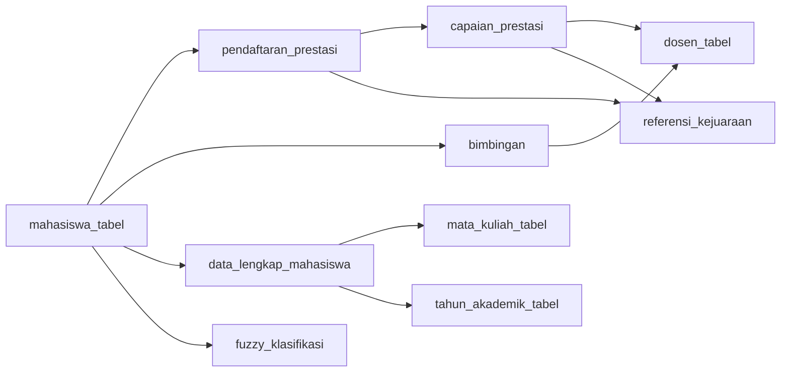

# Deskripsi Tabel & Relasi

## Tabel Autentikasi & Hak Akses

### `users`
Data akun login (web & API).

| Kolom | Tipe | Keterangan |
|-------|------|------------|
| id | bigint PK | |
| name | string | Nama pengguna |
| email | string UK | Email login |
| email_verified_at | timestamp nullable | |
| password | string | Hash bcrypt |
| role | string | Default `mahasiswa` |
| remember_token | string nullable | |

### `roles`
| Kolom | Tipe | Keterangan |
|-------|------|------------|
| id | bigint PK | |
| nama_role | string | Admin, Operator, Dosen, Mahasiswa |
| slug | string UK | `administrator`, `operator`, `dosen`, `mahasiswa` |
| deskripsi | string nullable | |
| level_akses | int | Hierarki 1–10 |
| is_active | boolean | |

### `permissions`
| Kolom | Tipe | Keterangan |
|-------|------|------------|
| id | bigint PK | |
| nama_permission | string | "Lihat Nilai", "Input Nilai" |
| modul | string | `mahasiswa`, `dosen`, ... |
| aksi | string | `create`, `read`, `update`, `delete`, `verify` |
| deskripsi | string nullable | |

### `role_user` (pivot)
| Kolom | Tipe | Keterangan |
|-------|------|------------|
| id | bigint PK | |
| user_id | FK → users.id | |
| role_id | FK → roles.id | Unique (user_id, role_id) |

### `role_permission` (pivot)
| Kolom | Tipe | Keterangan |
|-------|------|------------|
| id | bigint PK | |
| role_id | FK → roles.id | |
| permission_id | FK → permissions.id | Unique (role_id, permission_id) |

## Tabel Data Master

### `mahasiswa_tabel`
Data mahasiswa. Primary key **NIM**.

| Kolom | Tipe |
|-------|------|
| NIM | string PK (15) |
| nama | string |
| fakultas / prodi | string |
| tempat_lahir / tanggal_lahir | string / date |
| jenis_kelamin | string |
| email | string nullable |
| no_telepon / alamat | string |
| agama / kewarganegaraan / golongan_darah | string |
| status_pernikahan / status_aktif | string |

### `dosen_tabel`
Data dosen. Primary key **NIP**.

| Kolom | Tipe |
|-------|------|
| NIP | string PK |
| nama / fakultas / prodi / jabatan_akademik | string |
| email | string UK |
| no_telepon | string |
| status_aktif | boolean (default true) |

### `mata_kuliah_tabel`
Primary key **kode_matkul**. Kolom: `nama_matkul`, `sks`, `semester`, `prodi`, `jenis` (wajib/pilihan), `status_aktif`.

### `tahun_akademik_tabel`
Kolom: `tahun_akademik` (mis. "2024/2025"), `semester` (Ganjil/Genap), `tanggal_mulai`, `tanggal_selesai`, `status` (aktif/nonaktif).

### `referensi_kejuaraan`
Daftar kejuaraan & bobot poin. Primary key **ref_id** (string, mis. `REF-1A2B3`).

| Kolom | Tipe |
|-------|------|
| ref_id | string PK |
| nama_kejuaraan | string |
| bobot_poin | int |

## Tabel Transaksi

### `pendaftaran_prestasi`
Pendaftaran mahasiswa pada suatu kejuaraan. Primary key **pendaftaran_id** (string, mis. `REG-...`).

| Kolom | Tipe | Relasi |
|-------|------|--------|
| pendaftaran_id | string PK | |
| NIM | string FK | → mahasiswa_tabel.NIM |
| ref_id | string FK | → referensi_kejuaraan.ref_id |
| nama_kegiatan | string | |
| status | enum | `pending`, `disetujui`, `tidak_disetujui` (default pending) |

### `capaian_prestasi`
Hasil/capaian dari sebuah pendaftaran. Primary key **capaian_id** (string, mis. `CAP-...`).

| Kolom | Tipe | Relasi |
|-------|------|--------|
| capaian_id | string PK | |
| pendaftaran_id | string FK | → pendaftaran_prestasi.pendaftaran_id |
| peringkat | string | mis. "Juara 1" |
| file_bukti | string nullable | path file |
| NIP | string FK | → dosen_tabel.NIP (pembimbing/verifikator) |

### `bimbingan`
Catatan bimbingan dosen ke mahasiswa.

| Kolom | Tipe | Relasi |
|-------|------|--------|
| id | bigint PK | |
| nim_mahasiswa | string FK | → mahasiswa_tabel.NIM |
| nip_dosen | string FK | → dosen_tabel.NIP |
| tanggal_bimbingan | date | |

### `data_lengkap_mahasiswa`
Mata kuliah yang ditempuh mahasiswa per tahun akademik.

| Kolom | Tipe | Relasi |
|-------|------|--------|
| id | bigint PK | |
| nim_mahasiswa | string FK | → mahasiswa_tabel.NIM |
| matkul | string FK | → mata_kuliah_tabel.kode_matkul |
| tahun_akademik_id | bigint FK | → tahun_akademik_tabel.id |

## Tabel Hasil Klasifikasi

### `fuzzy_klasifikasi`
Hasil perhitungan Fuzzy Logic per mahasiswa. Satu mahasiswa → satu baris (NIM unique).

| Kolom | Tipe | Keterangan |
|-------|------|------------|
| id | bigint PK | |
| NIM | string FK UK | → mahasiswa_tabel.NIM |
| jumlah_prestasi | tinyint | Banyaknya pendaftaran `disetujui` |
| total_poin | smallint | Total bobot poin |
| peringkat_terbaik | tinyint | Peringkat terbaik (1 = juara 1); 0 jika tidak ada |
| skor_fuzzy | decimal(5,2) | Skor defuzzifikasi 0–100 |
| label_fuzzy | string | Sangat/Berprestasi/Cukup/Kurang Berprestasi |

## Ringkasan Relasi Utama

