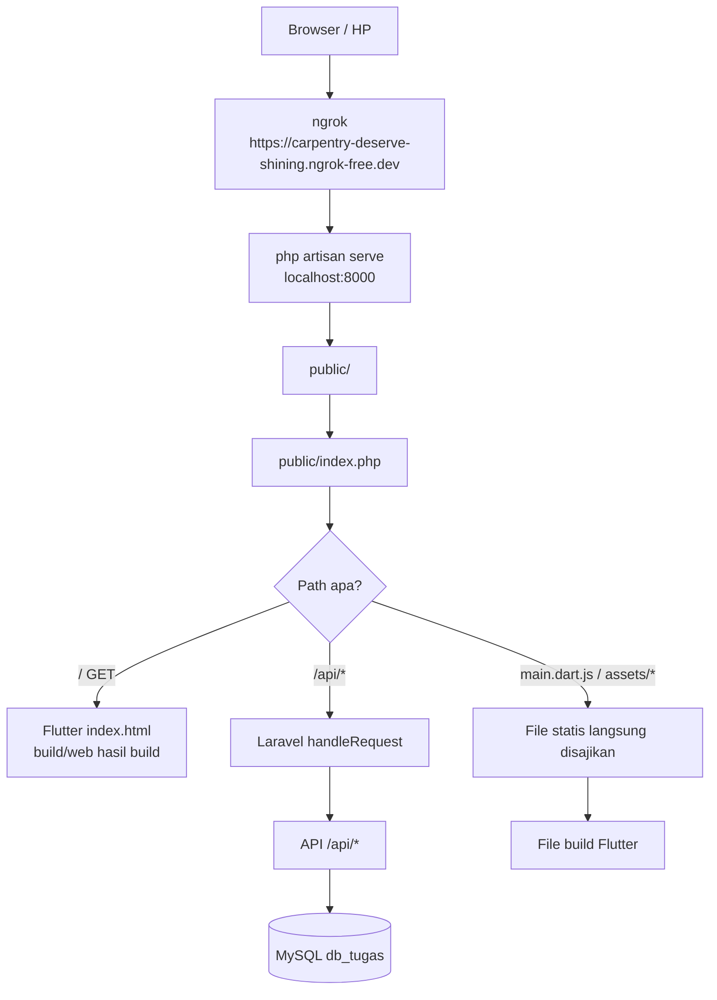
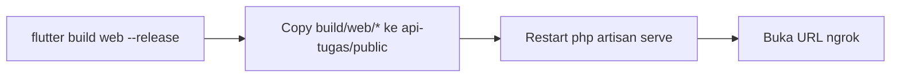

# Arsitektur Deployment (Satu-Origin)

Flutter Web dan API Laravel disajikan dari **satu origin** sehingga aplikasi dapat diakses melalui satu URL tanpa konflik CORS.

## Diagram



## Cara Kerja `public/index.php`

Front controller Laravel dimodifikasi agar route root menyajikan aplikasi Flutter:

```php
$uri = urldecode(parse_url($_SERVER['REQUEST_URI'] ?? '/', PHP_URL_PATH) ?? '/');
if ($uri === '/' && ($_SERVER['REQUEST_METHOD'] ?? 'GET') === 'GET' && file_exists(__DIR__.'/index.html')) {
    require __DIR__.'/index.html';
    return;
}
// ... bootstrap Laravel normal untuk /api/*
```

- **`/`** → menyajikan `index.html` Flutter (SPA)
- **File statis** (`main.dart.js`, `assets/`, `canvaskit/`) → disajikan langsung oleh server
- **`/api/*`** → ditangani Laravel (route API)

## Struktur `public/` Setelah Deploy

```
public/
├── index.php              # Front controller (modifikasi)
├── index.html             # Flutter (hasil build)
├── main.dart.js           # Flutter engine
├── flutter_bootstrap.js
├── assets/                # Flutter assets
├── canvaskit/             # CanvasKit renderer
├── icons/                 # Ikon Flutter
├── storage/               # File upload Laravel (disimpan!)
├── gambar/                # Asset web Laravel
├── music/                 # Asset web Laravel
└── ...
```

## Keuntungan Satu-Origin

- Tidak ada **CORS** (aplikasi & API sama origin)
- Satu URL publik untuk semua
- File statis Flutter tidak perlu server terpisah

## Alur Deploy


