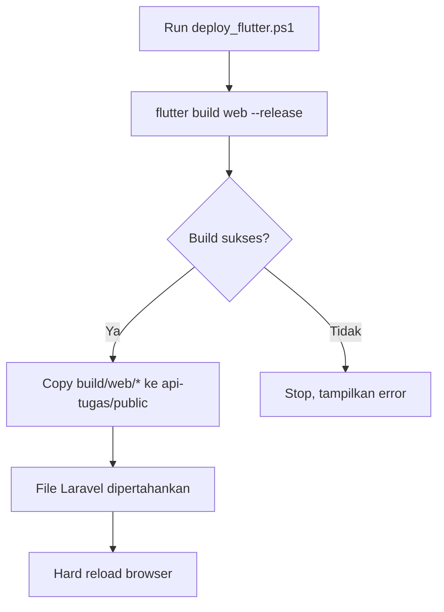

# Script Deploy — `deploy_flutter.ps1`

Script PowerShell untuk otomatisasi **build Flutter web** dan **copy ke `public/` Laravel**.

## Lokasi

```
C:\projectflutter\prestasi-mahasiswa\deploy_flutter.ps1
```

## Isi Script

```powershell
param(
    [string]$FlutterDir = "capaian_prestasi",
    [string]$TargetDir = "api-tugas\public"
)

$ErrorActionPreference = "Stop"
$root = $PSScriptRoot
$flutterProj = Join-Path $root $FlutterDir
$buildOut = Join-Path $flutterProj "build\web"
$target = Join-Path $root $TargetDir

Write-Host "=== Deploy Flutter web -> Laravel public ===" -ForegroundColor Cyan

if (-not (Test-Path $flutterProj)) { Write-Error "Flutter project not found: $flutterProj"; exit 1 }
if (-not (Test-Path $target)) { Write-Error "Target not found: $target"; exit 1 }

Write-Host "1/3 Building Flutter web (release)..."
Push-Location $flutterProj
try {
    flutter build web --release
    if ($LASTEXITCODE -ne 0) { Write-Error "flutter build failed (exit $LASTEXITCODE)" }
} finally {
    Pop-Location
}

Write-Host "2/3 Copying build output to $target ..."
Copy-Item -Path "$buildOut\*" -Destination $target -Recurse -Force

Write-Host "3/3 Done." -ForegroundColor Green
Write-Host "Flutter web deployed. Laravel files (index.php, storage, gambar, music) are preserved."
Write-Host "Just refresh the ngrok URL - hard reload (Ctrl+Shift+R) to bypass service worker cache."
```

## Cara Pakai

```powershell
# Dari root project
powershell -ExecutionPolicy Bypass -File .\deploy_flutter.ps1
```

## Alur



## Catatan

- File Laravel (`index.php`, `storage/`, `gambar/`, `music/`) **tidak dihapus** karena script hanya melakukan copy (bukan mirror).
- Setelah deploy, lakukan **hard reload** (Ctrl+Shift+R) untuk menghindari cache service worker Flutter.
