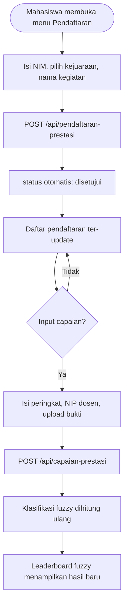
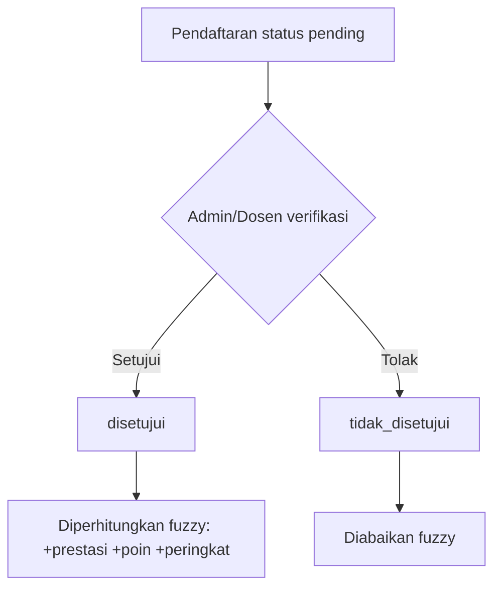

# Alur Pendaftaran → Capaian → Klasifikasi

## Flowchart Lengkap

## Alur Verifikasi (Web Admin)

## Ringkasan Status

| Status | Dihitung Fuzzy | Keterangan |
|--------|----------------|------------|
| `disetujui` | ✅ Ya | Masuk agregasi jumlah prestasi, poin, peringkat |
| `pending` | ❌ Tidak | Menunggu verifikasi |
| `tidak_disetujui` | ❌ Tidak | Ditolak |

> **Catatan**: Pada aplikasi Flutter, pendaftaran baru otomatis berstatus `disetujui` sehingga langsung memengaruhi klasifikasi fuzzy.
