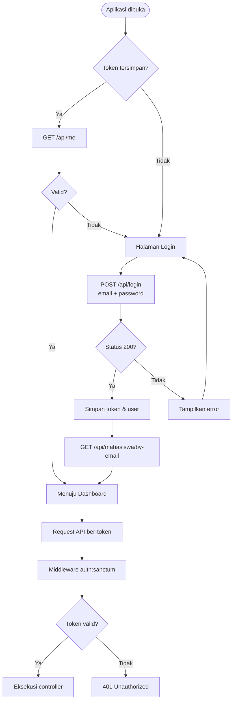
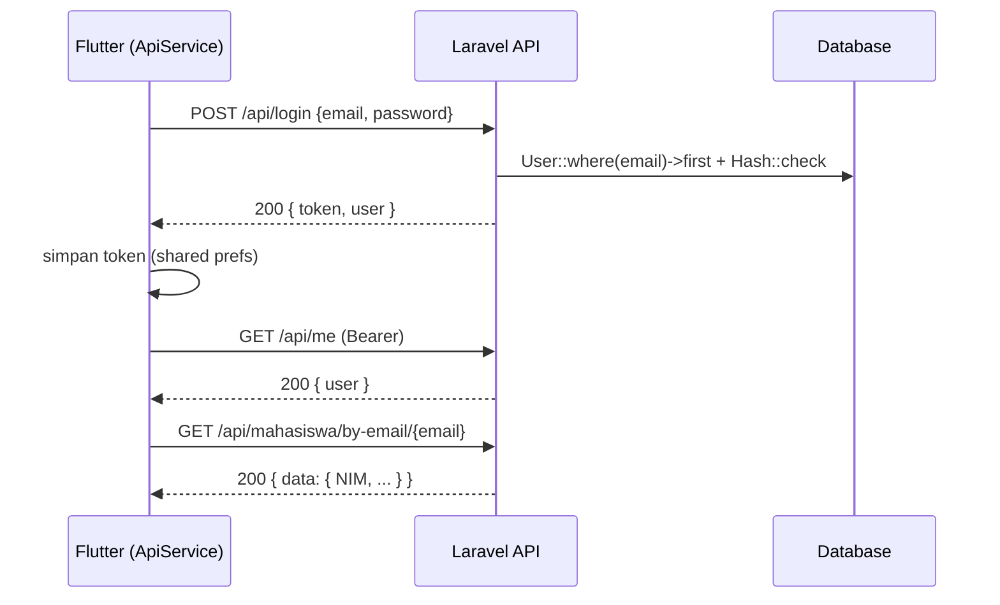
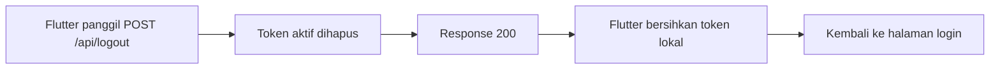

# Alur Autentikasi API (Sanctum)

Aplikasi Flutter mengonsumsi API dengan autentikasi **Bearer Token** (Laravel Sanctum).

## Flowchart



## Format Request

Setiap request API (selain login/register) menyertakan header:

```http
Authorization: Bearer <token>
Accept: application/json
```

## Sequence Login



## Logout


