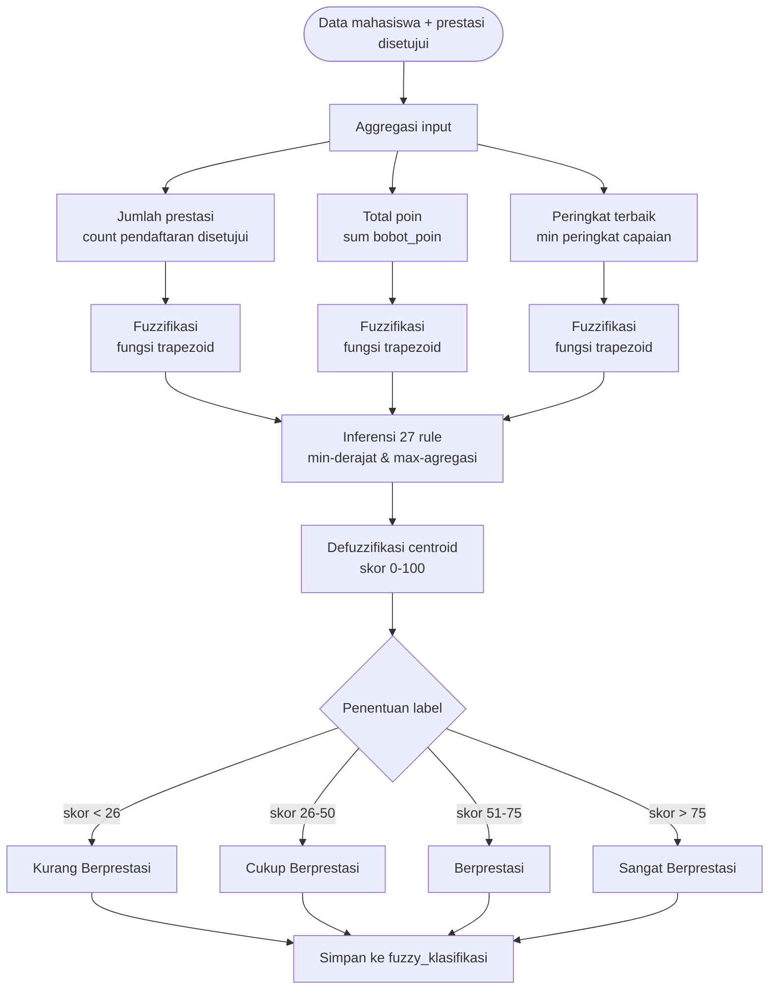

# Proses Klasifikasi Fuzzy (Mamdani)

Klasifikasi menggunakan **Fuzzy Logic metode Mamdani** dengan tiga variabel input dan satu output.

## Variabel

| Variabel | Himpunan | Domain |
|----------|----------|--------|
| **Input 1: Jumlah Prestasi** | Sedikit, Sedang, Banyak | [0 – 10] |
| **Input 2: Total Poin** | Rendah, Sedang, Tinggi | [0 – 120] |
| **Input 3: Kualitas Peringkat** | Jauh, Mendekati, Terbaik | [1 – 50] |
| **Output: Skor Prestasi** | Kurang, Cukup, Berprestasi, Sangat | [0 – 100] |

## Flowchart Proses



## Fuzzifikasi — Fungsi Trapezoid

Derajat keanggotaan dihitung dengan fungsi trapezoid:

```mermaid
flowchart LR
    A[Nilai input x] --> B{trapezoid x, a, b, c, d}
    B -- x < a atau x > d --> C[0.0]
    B -- b <= x <= c --> D[1.0]
    B -- a <= x < b --> E[(x - a) / (b - a)]
    B -- c < x <= d --> F[(d - x) / (d - c)]
```

## Contoh Rule (3 dari 27)

| Jumlah Prestasi | Total Poin | Peringkat | Output |
|-----------------|------------|-----------|--------|
| Sedikit | Rendah | Terbaik | Cukup Berprestasi |
| Sedang | Sedang | Terbaik | Berprestasi |
| Banyak | Tinggi | Terbaik | Sangat Berprestasi |

## Defuzzifikasi

Skor akhir dihitung dengan **metode centroid** (titik berat) pada seluruh area output hasil agregasi:

```
skor = Σ (x * µ(x)) / Σ µ(x),  untuk x = 0..100
```

Hasil dibulatkan 2 desimal lalu dipetakan ke label.

## Kode Sumber

Implementasi berada di `app/Services/FuzzyPrestasiService.php`:

| Method | Fungsi |
|--------|--------|
| `trapezoid()` | Fungsi keanggotaan trapezoid |
| `fuzzifyJumlahPrestasi()` | Fuzzifikasi variabel 1 |
| `fuzzifyTotalPoin()` | Fuzzifikasi variabel 2 |
| `fuzzifyKualitasPeringkat()` | Fuzzifikasi variabel 3 |
| `defuzzify()` | Defuzzifikasi centroid |
| `classify($nim)` | Proses lengkap untuk satu mahasiswa |
| `classifyAll()` | Proses untuk semua mahasiswa (ranking) |
