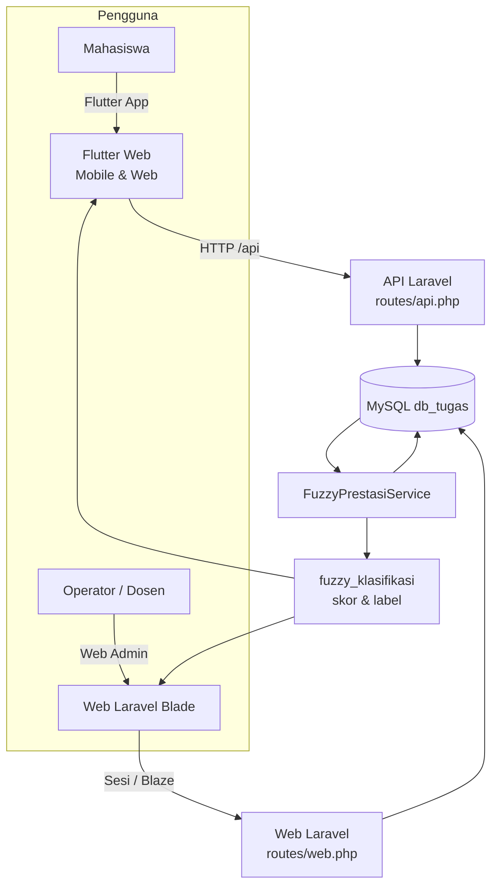
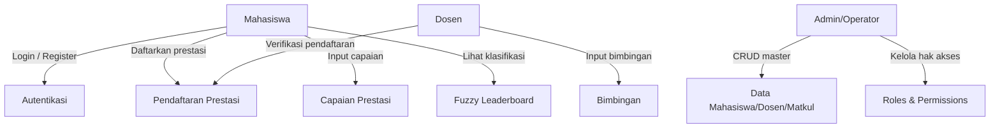

# Flowchart Sistem

## Arsitektur Keseluruhan

## Alur Data Prestasi

## Diagram Use-Case Ringkas

## Peta Halaman

| Aplikasi | Alur Halaman |
|----------|--------------|
| Flutter | Splash → Login → MainShell (8 menu) |
| Web Laravel | Landing → Login → Dashboard/Data Mahasiswa → modul CRUD |
