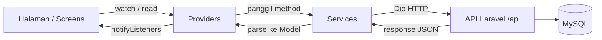

# Arsitektur Aplikasi Flutter

Aplikasi menggunakan pola **Provider + Repository/Service** dengan alur satu arah:



## Lapisan Aplikasi

### 1. UI Layer (`lib/screens/`)
Halaman-halaman Flutter yang hanya bertanggung jawab menampilkan data dan menangkap interaksi pengguna. Mengakses state melalui `context.watch` / `context.read` dari Provider.

### 2. State Layer (`lib/providers/`)
`ChangeNotifier` yang menyimpan state dan memanggil service. Setiap perubahan state memanggil `notifyListeners()` sehingga UI ikut ter-update.

| Provider | Tanggung Jawab |
|----------|----------------|
| `AuthProvider` | Login, register, load user, auto-login, logout, simpan NIM |
| `MahasiswaProvider` | Data mahasiswa, data lengkap, klasifikasi fuzzy (pribadi & leaderboard) |
| `PrestasiProvider` | Referensi, pendaftaran, capaian prestasi |
| `BimbinganProvider` | Data bimbingan |
| `DosenProvider` | Data dosen |

### 3. Service Layer (`lib/services/`)
Membungkus panggilan HTTP (Dio) ke endpoint API dan melempar error yang sudah dibersihkan ke Provider.

### 4. Model Layer (`lib/models/`)
Kelas Dart (POJO) hasil parsing JSON dari respons API, mis. `FuzzyKlasifikasi`, `PendaftaranPrestasi`, `CapaianPrestasi`.

## Injeksi Dependensi

Semua provider dibuat di `main.dart` melalui `MultiProvider`, berbagi satu instance `ApiService`:

```dart
final apiService = ApiService();

MultiProvider(
  providers: [
    ChangeNotifierProvider(create: (_) => AuthProvider(apiService)),
    ChangeNotifierProvider(create: (_) => MahasiswaProvider(apiService)),
    ChangeNotifierProvider(create: (_) => PrestasiProvider(apiService)),
    ChangeNotifierProvider(create: (_) => BimbinganProvider(apiService)),
    ChangeNotifierProvider(create: (_) => DosenProvider(apiService)),
  ],
  child: MaterialApp(...),
)
```

## Komunikasi API

`ApiService` mengonfigurasi instance **Dio** dengan:

- `baseUrl` dari `ApiConfig.baseUrl` (`https://carpentry-deserve-shining.ngrok-free.dev`)
- Header `Accept: application/json`
- Header `ngrok-skip-browser-warning: true` (mengabaikan interstitial ngrok)
- Interceptor menambahkan `Authorization: Bearer <token>` setelah login

Token disimpan lokal sehingga aplikasi dapat melakukan **auto-login** saat dibuka kembali.
