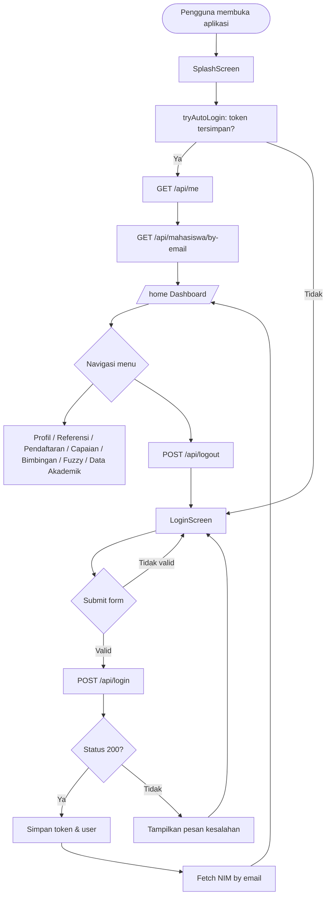
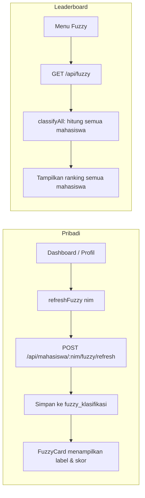
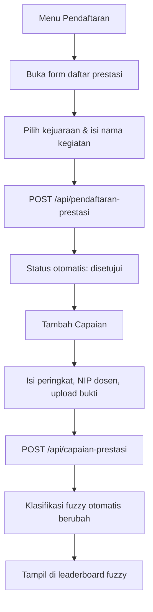

# Flowchart Aplikasi Flutter

## Alur Autentikasi (Login)

```mermaid
flowchart TD
    Start([Pengguna membuka aplikasi]) --> Splash[SplashScreen]
    Splash --> Check[tryAutoLogin: token tersimpan?]
    Check -- Ya --> Me[GET /api/me]
    Me --> Nim[GET /api/mahasiswa/by-email]
    Nim --> Home[/home Dashboard/]
    Check -- Tidak --> Login[LoginScreen]
    Login --> Sub{Submit form}
    Sub -- Tidak valid --> Login
    Sub -- Valid --> Auth[POST /api/login]
    Auth --> Ok{Status 200?}
    Ok -- Ya --> Save[Simpan token & user]
    Save --> Nim2[Fetch NIM by email] --> Home
    Ok -- Tidak --> Err[Tampilkan pesan kesalahan] --> Login
    Home --> Nav{Navigasi menu}
    Nav --> Menu1[Profil / Referensi / Pendaftaran / Capaian / Bimbingan / Fuzzy / Data Akademik]
    Nav --> Logout[POST /api/logout]
    Logout --> Login
```

## Alur Klasifikasi Fuzzy di Aplikasi

Terdapat dua jalur klasifikasi di aplikasi:

```mermaid
flowchart LR
    subgraph Pribadi
        A[Dashboard / Profil] --> B[refreshFuzzy nim]
        B --> C[POST /api/mahasiswa/:nim/fuzzy/refresh]
        C --> D[Simpan ke fuzzy_klasifikasi]
        D --> E[FuzzyCard menampilkan label & skor]
    end
    subgraph Leaderboard
        F[Menu Fuzzy] --> G[GET /api/fuzzy]
        G --> H[classifyAll: hitung semua mahasiswa]
        H --> I[Tampilkan ranking semua mahasiswa]
    end
```

## Alur Tambah Prestasi

```mermaid
flowchart TD
    A[Menu Pendaftaran] --> B[Buka form daftar prestasi]
    B --> C[Pilih kejuaraan & isi nama kegiatan]
    C --> D[POST /api/pendaftaran-prestasi]
    D --> E[Status otomatis: disetujui]
    E --> F[Tambah Capaian]
    F --> G[Isi peringkat, NIP dosen, upload bukti]
    G --> H[POST /api/capaian-prestasi]
    H --> I[Klasifikasi fuzzy otomatis berubah]
    I --> J[Tampil di leaderboard fuzzy]
```
