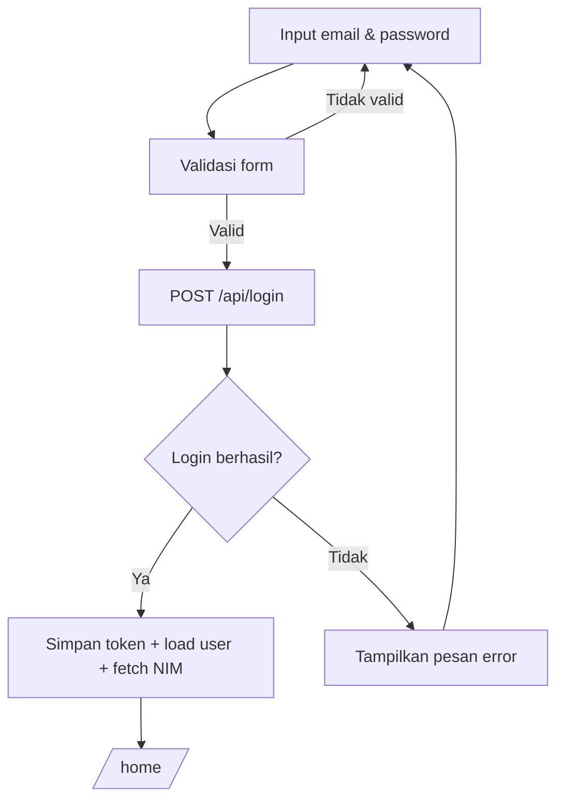
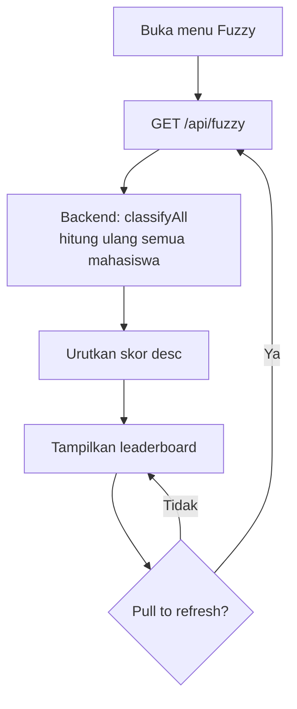

# Halaman Aplikasi Flutter

## 1. SplashScreen (`/`)

Layar pembuka dengan logo aplikasi. Di layar ini, aplikasi mencoba **auto-login** (memeriksa token tersimpan). Jika berhasil, langsung menuju shell utama; jika tidak, ke halaman login.

## 2. LoginScreen (`/login`)

Landing page aplikasi. Memiliki:

- Latar **gradasi indigo** (`#1A237E → #3949AB → #5C6BC0`)
- Form **email** & **password** (dengan toggle tampil/sembunyi)
- Tombol **Masuk** — memanggil `POST /api/login`, menyimpan token, lalu mengambil data user & NIM
- Link menuju **Daftar** (register)

## 3. RegisterScreen (`/register`)

Form pendaftaran akun baru: nama, email, password, konfirmasi password. Memanggil `POST /api/register`. Akun baru otomatis diberi peran `mahasiswa`.

## 4. HomeScreen (Dashboard)

- Sapaan pengguna + avatar
- Kartu **Klasifikasi Prestasi** (`FuzzyCard`) — menampilkan label & skor fuzzy pengguna saat ini
- Info penggunaan menu

## 5. ProfileScreen

Menampilkan data profil mahasiswa dari `GET /api/mahasiswa/{nim}`.

## 6. ReferensiScreen

Daftar **referensi kejuaraan** dari `GET /api/referensi-kejuaraan` — nama lomba dan bobot poin.

## 7. PendaftaranScreen (List & Create)

- **List**: daftar pendaftaran prestasi (filter per NIM) dengan status `Pending` / `Disetujui` / `Ditolak`
- **Create**: form NIM (otomatis dari akun), pilih kejuaraan (dropdown referensi), nama kegiatan. POST `/api/pendaftaran-prestasi`. Status otomatis **`disetujui`** sehingga langsung dihitung oleh fuzzy.

## 8. CapaianScreen (List & Create)

- **List**: daftar capaian prestasi dengan peringkat & file bukti
- **Create**: form ID pendaftaran, peringkat (mis. "Juara 1"), NIP dosen pembimbing, upload file bukti. POST `/api/capaian-prestasi`.

## 9. BimbinganScreen

Daftar & pencatatan bimbingan dengan dosen (`GET /api/bimbingan?nim=...`).

## 10. FuzzyKlasifikasiScreen — Leaderboard

Menampilkan **klasifikasi fuzzy seluruh mahasiswa** secara berurutan (skor tertinggi ke bawah):

- Kartu header "Leaderboard Prestasi" + total mahasiswa
- Badge peringkat: 🥇 emas, 🥈 perak, 🥉 perunggu (top 3)
- Setiap baris: nama, NIM, prodi, skor fuzzy, dan label berwarna
- Data dimuat dari `GET /api/fuzzy` (dihitung ulang oleh backend saat dipanggil)
- Mendukung pull-to-refresh

## 11. DataLengkapScreen

Data akademik mahasiswa: mata kuliah & tahun akademik dari `GET /api/data-lengkap-mahasiswa?nim=...`.
