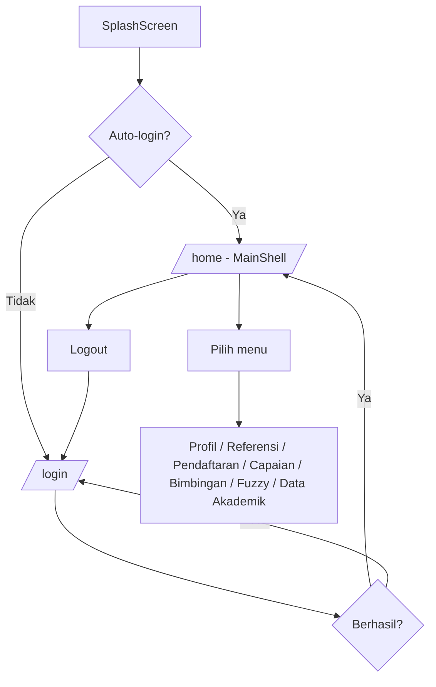
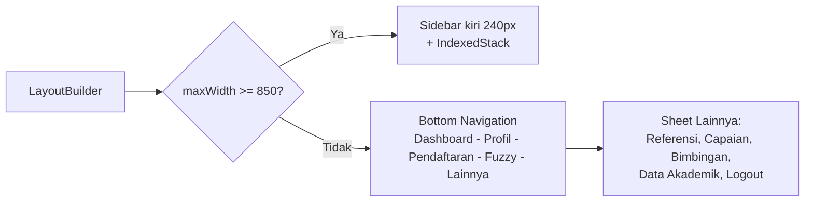

# Routing & Navigasi

## Route Aplikasi

Semua route didefinisikan di `lib/main.dart`:

| Route | Halaman |
|-------|---------|
| `/` | SplashScreen |
| `/login` | LoginScreen |
| `/register` | RegisterScreen |
| `/home` | MainShellScreen (shell utama) |
| `/profile` | ProfileScreen |
| `/referensi` | ReferensiScreen |
| `/pendaftaran-list` | PendaftaranListScreen |
| `/pendaftaran-create` | PendaftaranCreateScreen |
| `/capaian-list` | CapaianListScreen |
| `/capaian-create` | CapaianCreateScreen |
| `/bimbingan` | BimbinganScreen |
| `/fuzzy` | FuzzyKlasifikasiScreen |
| `/data-lengkap` | DataLengkapScreen |

## Alur Navigasi Awal

## MainShellScreen — Shell Responsive

`MainShellScreen` menampung 8 halaman utama dalam `IndexedStack` (state tiap halaman tetap terjaga saat berpindah menu). Navigasi menyesuaikan lebar layar:

### Daftar Menu

| # | Menu | Ikon | Indeks |
|---|------|------|--------|
| 1 | Dashboard | dashboard | 0 |
| 2 | Profil | person | 1 |
| 3 | Referensi | emoji_events | 2 |
| 4 | Pendaftaran | assignment | 3 |
| 5 | Capaian | verified | 4 |
| 6 | Bimbingan | forum | 5 |
| 7 | Fuzzy | auto_graph | 6 |
| 8 | Data Akademik | book | 7 |

## Penentuan NIM Pengguna

Setelah login, aplikasi mengambil NIM melalui `GET /api/mahasiswa/by-email/{email}`. NIM inilah yang dipakai untuk:

- Memuat klasifikasi fuzzy pribadi
- Mengisi otomatis NIM pada form pendaftaran prestasi

Jika akun tidak terhubung ke data mahasiswa (NIM tidak ditemukan), aplikasi tetap bisa digunakan untuk melihat **leaderboard fuzzy** semua mahasiswa.
