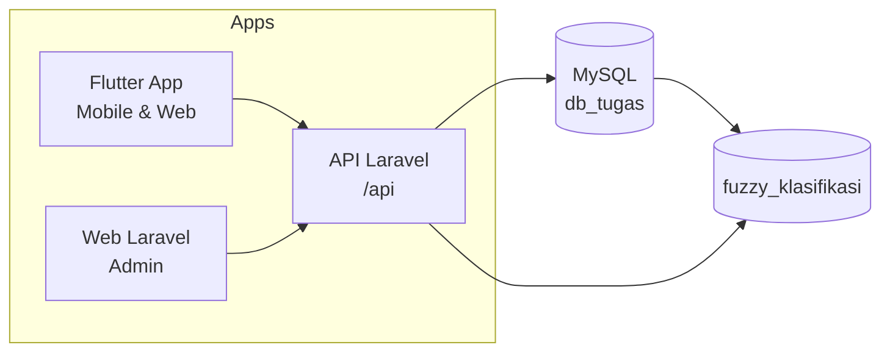

  
Dokumentasi Sistem Pencatatan Prestasi Mahasiswa

  <h1 class="lp-title">Satu sistem, <em>dua aplikasi</em>, klasifikasi prestasi berbasis fuzzy</h1>
  
Dokumentasi lengkap untuk aplikasi Flutter (mobile & web) dan web admin Laravel — berbagi satu basis data dan satu API dengan perankingan prestasi menggunakan Fuzzy Logic (Mamdani).

  

    <a class="lp-btn lp-btn-primary" href="/flutter/overview">Mulai dari Aplikasi Flutter</a>
    <a class="lp-btn lp-btn-secondary" href="/database/erd">Lihat ERD Database</a>
  

  

    FlutterDart 3ProviderDioMaterial 3Laravel 13BladeBootstrap 5MySQLSanctumFuzzy Mamdani
  

## Dua Aplikasi, Satu Sistem

<a class="lp-card" href="/flutter/overview">
  
Mobile &amp; Web

  <h3>Aplikasi Flutter — Prestasi Mahasiswa</h3>
  
Aplikasi lintas platform untuk mahasiswa: dashboard klasifikasi, pendaftaran prestasi, input capaian, leaderboard fuzzy, bimbingan, dan data akademik.

  Baca dokumentasi →
</a>

<a class="lp-card" href="/laravel/overview">
  
Web Admin

  <h3>Web Laravel — Sistem Pencatatan Prestasi</h3>
  
Web admin berbasis Blade untuk operator & dosen: landing page berstatistik, CRUD lengkap, verifikasi pendaftaran, serta manajemen role & permission.

  Baca dokumentasi →
</a>

## Jelajahi Dokumentasi

<a class="lp-card" href="/database/erd">
  
Data

  <h3>Database</h3>
  
ERD 17 tabel dan penjelasan relasi antar tabel — mahasiswa, dosen, pendaftaran, capaian, klasifikasi fuzzy, hingga RBAC.

  Buka ERD →
</a>

<a class="lp-card" href="/flowchart/sistem">
  
Alur

  <h3>Flowchart Sistem</h3>
  
Alur pendaftaran → capaian → klasifikasi, proses fuzzy Mamdani, dan alur autentikasi API.

  Lihat flowchart →
</a>

<a class="lp-card" href="/api/reference">
  
Backend

  <h3>API Reference</h3>
  
Daftar lengkap endpoint API, format respons, dan contoh body request untuk integrasi aplikasi.

  Buka reference →
</a>

<a class="lp-card" href="/deployment/arsitektur">
  
Penyebaran

  <h3>Deployment</h3>
  
Arsitektur satu-origin — Flutter dan Laravel dalam satu URL — beserta script otomatisasi deploy.

  Baca deployment →
</a>

<a class="lp-card" href="/panduan/menjalankan">
  
Mulai

  <h3>Panduan</h3>
  
Cara menjalankan backend, aplikasi, dan situs ini, plus daftar akun bawaan dari seeder.

  Baca panduan →
</a>

<a class="lp-card" href="/laravel/modul">
  
Fitur

  <h3>Modul & Fitur</h3>
  
Rincian modul kedua aplikasi, skema RBAC, dan fitur unggulan sistem pencatatan prestasi mahasiswa.

  Lihat modul →
</a>

## Diagram Ringkas Sistem

