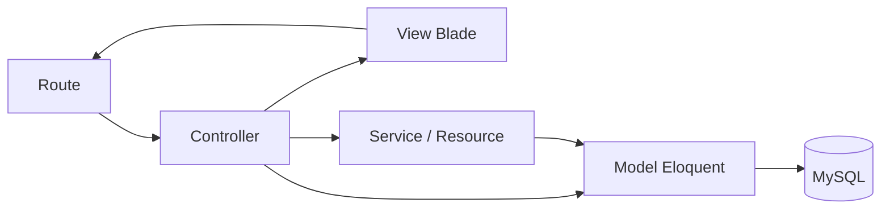
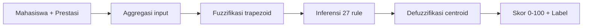
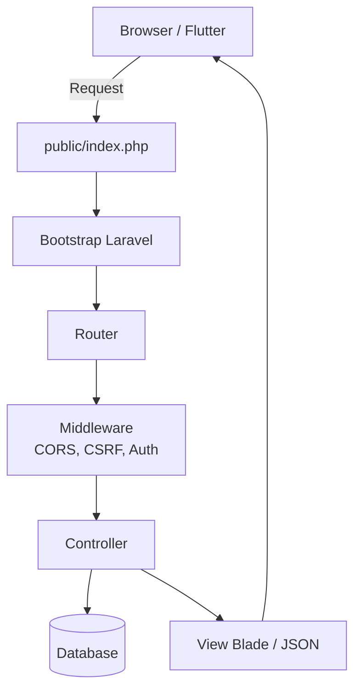

# Arsitektur Web Laravel

## Pola MVC + Service

## Komponen Utama

### Routes
- **`routes/web.php`** — route server-rendered (auth session, CRUD admin)
- **`routes/api.php`** — route JSON untuk aplikasi Flutter (auth Sanctum token)

### Controllers (`app/Http/Controllers/`)

| Controller | Modul |
|------------|-------|
| `AuthController` | Register / login / logout / me (API) |
| `MahasiswaController` | CRUD mahasiswa + fuzzy + by-email |
| `DosenController` | CRUD dosen |
| `MataKuliahController` | CRUD mata kuliah |
| `TahunAkademikController` | CRUD tahun akademik |
| `BimbinganController` | CRUD bimbingan + verifikasi |
| `DataLengkapMahasiswaController` | CRUD data lengkap |
| `ReferensiKejuaraanController` | CRUD referensi kejuaraan |
| `PendaftaranPrestasiController` | CRUD + verifikasi pendaftaran |
| `CapaianPrestasiController` | CRUD capaian + file bukti |
| `FuzzyKlasifikasiController` | Tampilan & refresh klasifikasi (web) |
| `RoleController` / `PermissionController` | Hak akses |
| `UserManagementController` | Manajemen user & role |

### Service — `FuzzyPrestasiService`

Service khusus yang mengimplementasikan **logika Fuzzy Logic Mamdani**:

### API Resources (`app/Http/Resources/`)

Mengubah model Eloquent menjadi struktur JSON standar untuk respons API (mis. `MahasiswaResource`, `PendaftaranPrestasiResource`).

## Alur Permintaan

## Middleware Penting

| Middleware | Fungsi |
|------------|--------|
| `CorsMiddleware` | Header CORS untuk akses lintas origin & ngrok |
| `ValidateCsrfTokens` | Proteksi CSRF (dikecualikan untuk `api/*`) |
| `auth:sanctum` | Proteksi route API dengan token |
| `auth` (session) | Proteksi route web admin |
