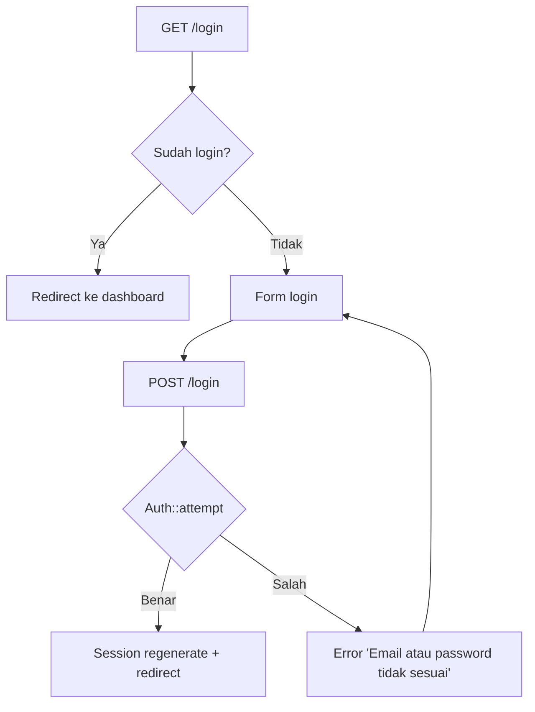
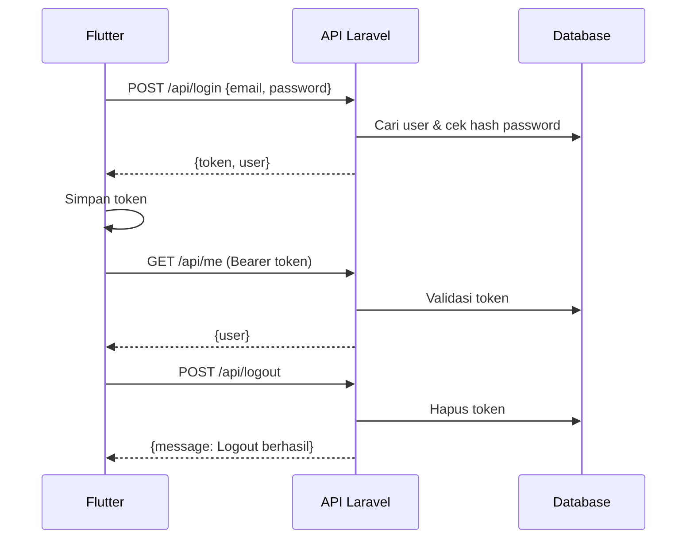

# Autentikasi

Sistem memiliki **dua mekanisme autentikasi** yang berjalan berdampingan:

| Aspek | Web Admin | API (Flutter) |
|-------|-----------|---------------|
| Metode | Sesi (session) | Token Bearer |
| Guard | `web` | `sanctum` |
| Middleware | `auth` | `auth:sanctum` |
| Simpan kredensial | Cookie sesi | Token `personal_access_tokens` |
| Endpoint | `/login` (POST form) | `/api/login` (JSON) |

## Web Admin (Session-based)

1. User membuka `/login`, mengisi email & password.
2. Laravel `Auth::attempt()` memverifikasi kredensial.
3. Jika benar, sesi di-regenerate dan user diarahkan ke dashboard.
4. `POST /logout` menghapus sesi.

## API (Token Sanctum)

1. Flutter memanggil `POST /api/login` dengan JSON `{email, password}`.
2. Server membuat token baru: `$user->createToken('auth-token')`.
3. Token dikembalikan (`plainTextToken`) dan disimpan Flutter.
4. Setiap request API menyertakan header `Authorization: Bearer <token>`.
5. `POST /api/logout` menghapus token aktif.

## Register

- **Web**: `POST /register` membuat user, melampirkan role `mahasiswa`, lalu auto-login.
- **API**: `POST /api/register` membuat user + token, mengembalikan `{user, token}`.

## Perlindungan CSRF

Route API (`/api/*`) **dikecualikan** dari validasi CSRF (karena menggunakan token Bearer). Route web tetap dilindungi CSRF (token pada setiap form Blade).
