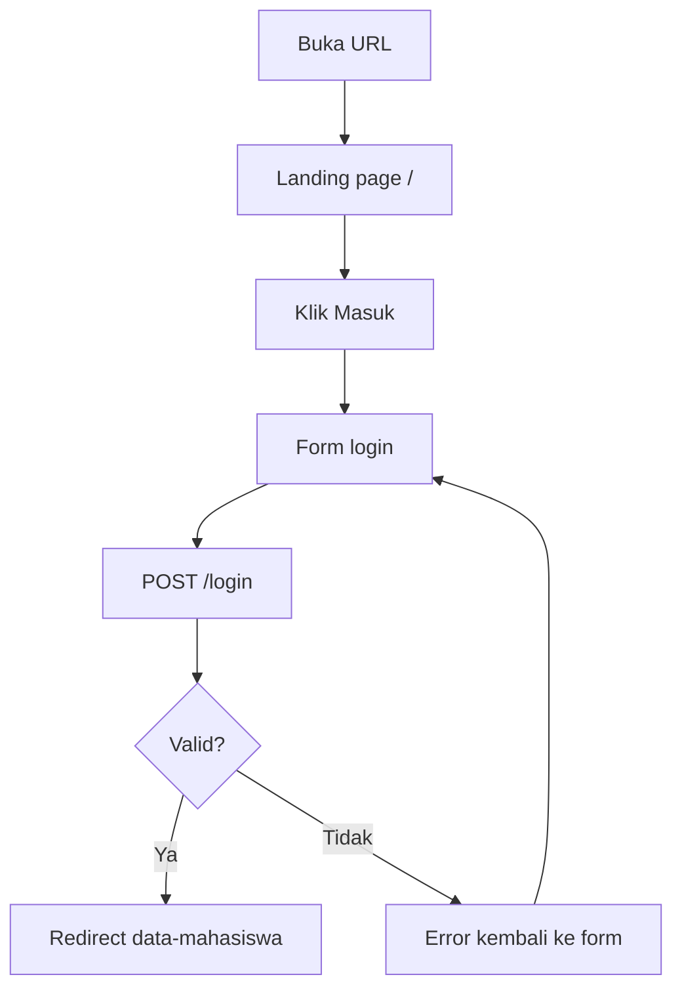
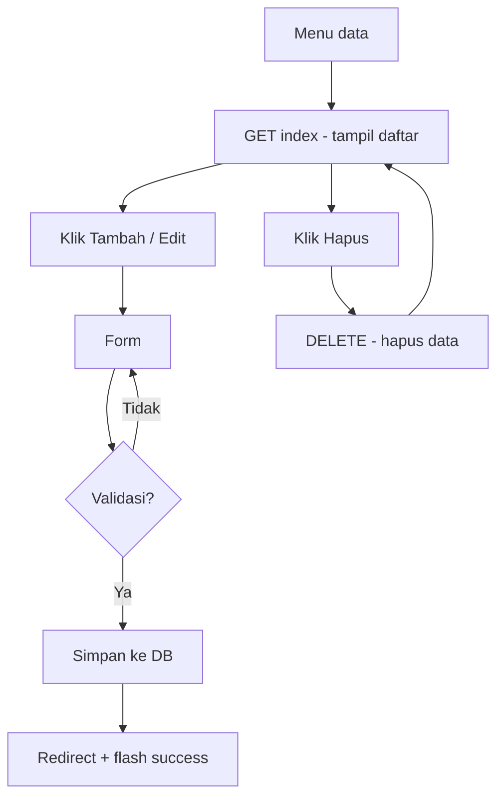
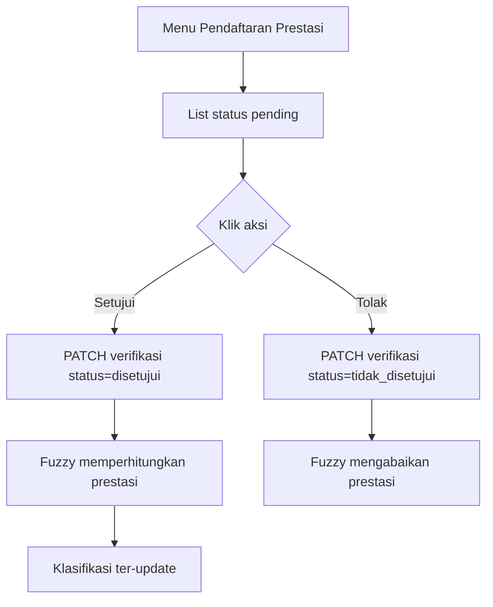
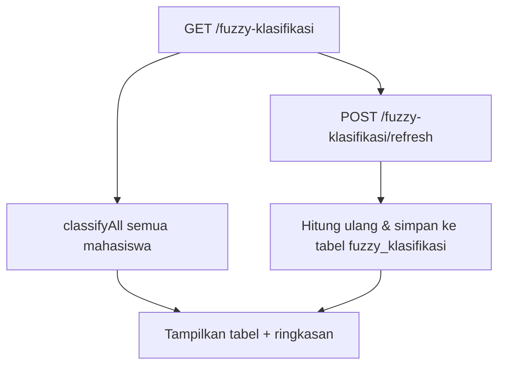

# Flowchart Web Laravel

## Alur Login Web Admin

```mermaid
flowchart TD
    A[Buka URL] --> B[Landing page /]
    B --> C[Klik Masuk]
    C --> D[Form login]
    D --> E[POST /login]
    E --> F{Valid?}
    F -- Ya --> G[Redirect data-mahasiswa]
    F -- Tidak --> H[Error kembali ke form]
    H --> D
```

## Alur CRUD Data Master

```mermaid
flowchart TD
    A[Menu data] --> B[GET index - tampil daftar]
    B --> C[Klik Tambah / Edit]
    C --> D[Form]
    D --> E{Validasi?}
    E -- Ya --> F[Simpan ke DB]
    E -- Tidak --> D
    F --> G[Redirect + flash success]
    B --> H[Klik Hapus]
    H --> I[DELETE - hapus data]
    I --> B
```

## Alur Verifikasi Pendaftaran

```mermaid
flowchart TD
    A[Menu Pendaftaran Prestasi] --> B[List status pending]
    B --> C{Klik aksi}
    C -- Setujui --> D[PATCH verifikasi status=disetujui]
    C -- Tolak --> E[PATCH verifikasi status=tidak_disetujui]
    D --> F[Fuzzy memperhitungkan prestasi]
    E --> G[Fuzzy mengabaikan prestasi]
    F --> H[Klasifikasi ter-update]
```

## Alur Klasifikasi Fuzzy (Halaman `/fuzzy-klasifikasi`)

```mermaid
flowchart TD
    A[GET /fuzzy-klasifikasi] --> B[classifyAll semua mahasiswa]
    B --> C[Tampilkan tabel + ringkasan]
    A --> D[POST /fuzzy-klasifikasi/refresh]
    D --> E[Hitung ulang & simpan ke tabel fuzzy_klasifikasi]
    E --> C
```
