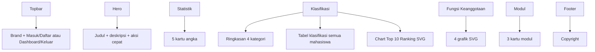
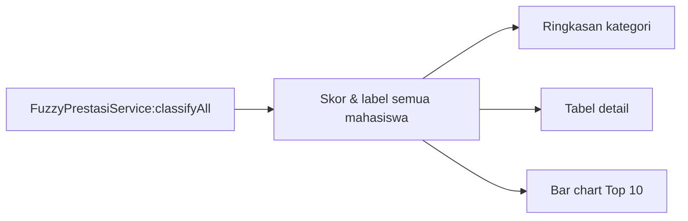

# Landing Page — `welcome.blade.php`

Landing page adalah halaman depan (`GET /`) yang menampilkan ringkasan sistem. Berbasis **Bootstrap 5** dengan **inline SVG** untuk grafik.

## Struktur Halaman

## Bagian Halaman

### 1. Topbar
- Brand: ikon trofi + "Sistem Prestasi"
- Jika **belum login**: tombol *Masuk* & *Daftar*
- Jika **sudah login**: tombol *Dashboard* & *Keluar*

### 2. Hero
Judul *"Sistem Pencatatan Prestasi Mahasiswa"*, deskripsi singkat, dan tombol aksi:
- *Masuk ke Sistem*
- *Lihat Pendaftaran*
- *Lihat Capaian*

### 3. Kartu Statistik (5 kartu)
| Kartu | Sumber Data |
|-------|-------------|
| Data Mahasiswa | `mahasiswa_tabel` count |
| Data Dosen | `dosen_tabel` count |
| Referensi Kejuaraan | `referensi_kejuaraan` count |
| Pendaftaran Prestasi | `pendaftaran_prestasi` count |
| Capaian Prestasi | `capaian_prestasi` count |

### 4. Klasifikasi Prestasi Mahasiswa
- Ringkasan jumlah mahasiswa per kategori: **Sangat / Berprestasi / Cukup / Kurang**
- **Tabel lengkap**: No, NIM, Nama, Prodi, Jml Prestasi, Total Poin, Peringkat Terbaik, Skor, Klasifikasi (badge berwarna)
- **Chart Top 10 Ranking** (SVG bar chart) dengan warna per kategori dan NIM dipersingkat

### 5. Grafik Fungsi Keanggotaan Fuzzy (4 grafik SVG)
Menampilkan kurva **trapezoid** untuk setiap variabel fuzzy:

| Grafik | Variabel | Himpunan | Domain |
|--------|----------|----------|--------|
| 1 | Jumlah Prestasi | Sedikit, Sedang, Banyak | [0 – 10] |
| 2 | Total Poin | Rendah, Sedang, Tinggi | [0 – 120] |
| 3 | Kualitas Peringkat | Terbaik, Mendekati, Jauh | [1 – 50] |
| 4 | Skor Prestasi (output) | Kurang, Cukup, Berprestasi, Sangat | [0 – 100] |

### 6. Kartu Modul
Tiga link cepat:
- **Referensi Kejuaraan**
- **Pendaftaran Prestasi**
- **Capaian Prestasi**

### 7. Footer
"© Sistem Pencatatan Prestasi Mahasiswa 2026"

## Catatan Deployment

Pada penyebaran **satu-origin** (Flutter + API + Web), route `/` disajikan oleh aplikasi **Flutter** melalui `public/index.php`. Landing page Blade tetap dapat diakses pada rute lain / lingkungan lokal sebelum Flutter di-deploy.
