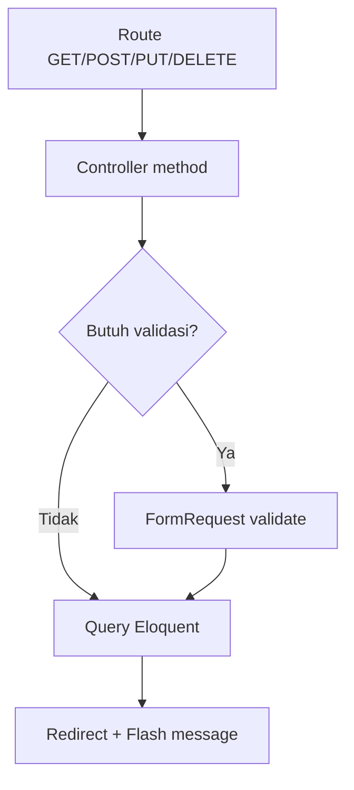
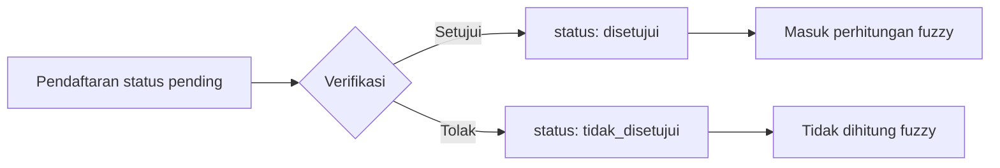

# Modul Web Laravel

Web admin Laravel menyediakan CRUD lengkap untuk setiap entitas. Semua route berada dalam middleware `auth` (sesi).

## Daftar Modul & Route

| Modul | Route Dasar | Hak Akses (permission) |
|-------|-------------|------------------------|
| Mahasiswa | `/data-mahasiswa`, `/create-mahasiswa`, `/mahasiswa/{NIM}`, `/edit-mahasiswa/{NIM}`, `/update-mahasiswa/{NIM}`, `/hapus-mahasiswa/{NIM}` | `mahasiswa.*` |
| Dosen | `/data-dosen`, `/create-dosen`, `/dosen/{NIP}`, ... | `dosen.*` |
| Mata Kuliah | `/data-mata-kuliah`, `/create-mata-kuliah`, `/mata-kuliah/{kode_matkul}`, ... | `mata-kuliah.*` |
| Tahun Akademik | `/data-tahun-akademik`, `/create-tahun-akademik`, ... | `tahun-akademik.*` |
| Bimbingan | `/data-bimbingan`, `/create-bimbingan`, ... | `bimbingan.*` |
| Data Lengkap Mahasiswa | `/data-lengkap-mahasiswa`, `/create-data-lengkap-mahasiswa`, ... | `data-lengkap-mahasiswa.*` |
| Referensi Kejuaraan | `/data-referensi-kejuaraan`, `/create-referensi-kejuaraan`, `/referensi-kejuaraan/{ref_id}`, ... | `referensi-kejuaraan.*` |
| Pendaftaran Prestasi | `/data-pendaftaran-prestasi`, `/create-pendaftaran-prestasi`, `/pendaftaran-prestasi/{id}`, `/pendaftaran-prestasi/{id}/verifikasi` | `pendaftaran-prestasi.*` |
| Capaian Prestasi | `/data-capaian-prestasi`, `/create-capaian-prestasi`, `/capaian-prestasi/{id}`, `/file-capaian-prestasi/{id}`, ... | `capaian-prestasi.*` |
| Klasifikasi Fuzzy | `/fuzzy-klasifikasi`, `/fuzzy-klasifikasi/refresh`, `/fuzzy-klasifikasi/{NIM}` | — |
| Hak Akses (Roles) | `/roles`, `/roles/create`, `/roles/{id}/edit`, ... | `hak-akses.*` |
| Manajemen User | `/hak-akses/users`, `/hak-akses/users/{id}/update-role` | Admin |

## Pola Controller

Setiap controller mengikuti pola standar:



Contoh method `store`:

```php
public function store(StorePendaftaranPrestasiRequest $request)
{
    $data = $request->validated();
    $data['status'] = $data['status'] ?? 'disetujui'; // default langsung disetujui
    $pendaftaran = PendaftaranPrestasi::create($data);
    return redirect()->route('pendaftaran-prestasi.index')
        ->with('success', 'Data berhasil ditambahkan');
}
```

## Verifikasi Pendaftaran

Admin/dosen dapat menyetujui atau menolak pendaftaran prestasi:



## Hak Akses (Role & Permission)

Sistem RBAC sederhana dengan tabel `roles`, `permissions`, `role_user`, `role_permission`.

| Role (seed) | Level | Keterangan |
|-------------|-------|------------|
| administrator | tinggi | Akses penuh |
| operator | sedang | Kelola data operasional |
| dosen | sedang | Verifikasi & pembimbing |
| mahasiswa | rendah | Akses terbatas |

Route web diberi proteksi `->middleware('can:modul.aksi')` berdasarkan permission.
