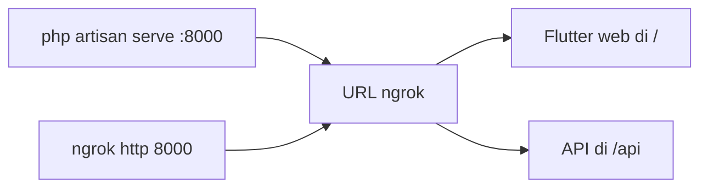

# Panduan Menjalankan Aplikasi

## Prasyarat

| Teknologi | Versi |
|-----------|-------|
| PHP & Composer | Laravel 13 compatible |
| MySQL | 8+ |
| Flutter | 3.x (Dart 3.11) |
| Node.js | 20+ (untuk dokumentasi ini) |

## 1. Menjalankan Backend Laravel

```bash
cd api-tugas

# Install dependensi
composer install

# Siapkan .env dari .env.example
cp .env.example .env

# Set kredensial database di .env
#   DB_CONNECTION=mysql
#   DB_DATABASE=db_tugas

# Jalankan migrasi + seed
php artisan migrate --seed

# Jalankan server
php artisan serve --port=8000
```

Server berjalan di `http://127.0.0.1:8000` — API di `http://127.0.0.1:8000/api`.

## 2. Menjalankan Aplikasi Flutter

### Mode Development (Web)

```bash
cd capaian_prestasi

flutter pub get
flutter run -d chrome --web-port=3001
```

> **Catatan CORS**: saat mode development, base URL API mengarah ke URL ngrok yang sudah dikonfigurasi CORS-nya.

### Build Web untuk Production (satu-origin)

```bash
cd ..
powershell -ExecutionPolicy Bypass -File .\deploy_flutter.ps1
```

Hasil build otomatis disalin ke `api-tugas/public/`.

## 3. Akses Publik via Ngrok

```bash
# Terminal backend
cd api-tugas
php artisan serve --port=8000

# Terminal ngrok
ngrok http 8000
```

Gunakan URL `https://...ngrok-free.dev` yang dihasilkan ngrok.



## 4. Menjalankan Website Dokumentasi (Ini)

```bash
cd prestasi-docs
npm install
npm run start
```

Buka `http://127.0.0.1:3000`.

### Build Statis

```bash
npm run build      # hasil di build/
npm run serve      # pratinjau build
```
